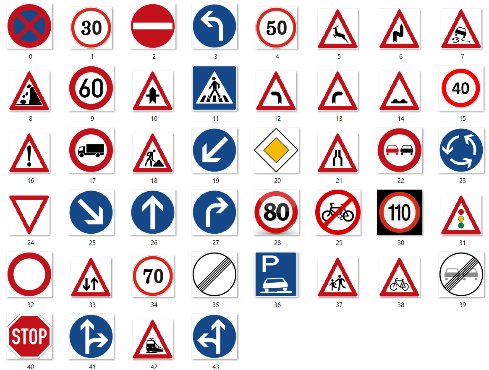
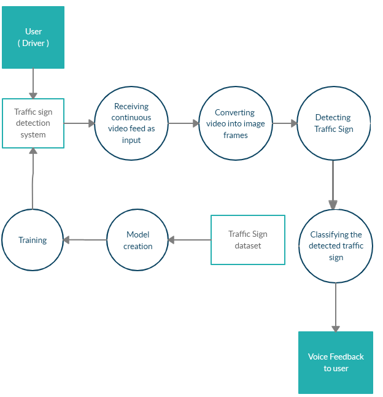
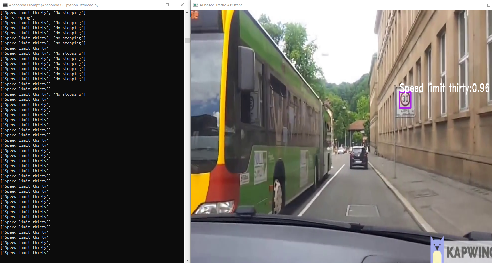
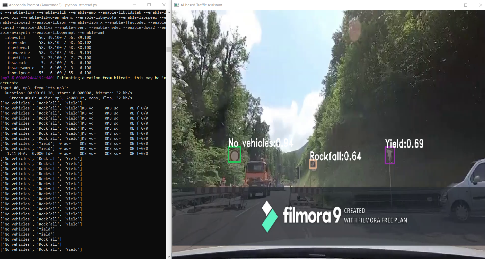

# Real-time-traffic-sign-detection-and-classification-with-voice-feedback

<br> 
<h2> Output Video </h2>

[](https://www.youtube.com/watch?v=A20vlHzG-ek&feature=youtu.be "Output Video")

<br>
<p>With the increase in number of road accidents happening every year, there has been a need to develop a system that contributes to the safety of the drivers, pedestrians and vehicles. Traffic sign detection and recognition plays an integral role for driver assistant system as well as autonomous driving vehicles.</p>
<p>In this project, an approach to assist the driver through traffic sign recognition with much more faster detection in conjunction with human-like general voice feedback has been presented.</p>
<hr>

<h2>Index</h2> 

<ol>
  <li>Installation</li>
  <li>Dataset</li>
  <li>Working</li>
  <li>Resutls</li>
</ol>
<hr>
<br><br>
<h2> Installation </h2>

Initially set up darknet by AlexyAb ( darknetSetup.ipynb )

Calculate anchor boxe values ( ancharCalculations.ipynb )

Model Training ( modelTraining.ipynb )

Weights Changing & Testing (Optional if you require Keras Implemenation)

After training we get .weights file so this weights can be used on our local machine program 

```

pip install opencv-python
pip install imutils
pip install subprocess
pip install pydub
pip install gTTS

```

for implementing real time audio we use ffmpeg <a href ="https://ffmpeg.org/"> ffmpeg </a> software.

<hr>
<br><br>
<h2> Dataset </h2>
<p> As our Meta data is mostly focusing on German Traffic signs, videos related to same are collected. As the video collected is raw, some processing has to be performed in order to obtain clean dataset. </p>

<h4> Meta Data (Classes) </h4>


<p> During the pre-processing, the part of the video that does not contain traffic sign is trimmed as it may add to the noisy data. After the entire video is trimmed, the frames are obtained at the rate 10 frames per second and each frame is saved as a jpeg file. Classes names are the found in obj.names file in the repository</p>

<h4> Dataset Distribution according to classes </h4>


<hr>
<br><br>
<h2> Working </h2>


<h3> Flow of our system </h3>


<h3> 1. Bounding box mechanism </h3>
<p>To accomplish this we used a tool OpenLabelling written in Python to draw bounding box for each traffic sign. YOLOv2 requires annotation text in XML file format while YOLOv3 requires the same in TXT file format. So, this tool generates a txt file for every image. The format of storing the annotation data in the
txt file is as follows:</p>

```

[class_id] [x] [y] [width] [height]
Where:
 - [class_id] : integer number of object class from 0 to (classes-1)
 - [x] [y] [width] [height] : float values according to width and height of image, it ranges from
0.0 to 1.0
 - [x] [y] : is the centre of rectangle (are not top-left corner).

```
<h3> 2. YoloV3 </h3>

<p> YOLOv3 makes prediction on the basis of darknet-53 at 3 different scales. Each location is being predicted 3 times by YOLOv3. Each prediction takes into account a boundary box, an object score and 44 class scores, i.e. N × N × [3 × (4 + 1 + 44)] predictions. Each block displays the following things that is the type of layer, the stride, number of filters and filter size. This means, with an input of 416 x 416, we make detections on scales 13 x 13, 26 x 26 and 52 x 52. Each cell predicts 3 bounding boxes using 3 anchors at each scale which makes the total number of anchors used as 9 (The anchors are different for different scales).
An image may contain many objects and each object is related with one grid cell. YOLO can work well in such situations where overlapping of centre points of two objects can occur. To allow a grid cell to detect multiple objects, YOLO uses anchor boxes. With the help of anchor boxes, a longer grid cell vector is created and multiple classes with each grid cell can be associated. Anchor boxes have a defined aspect ratio with which they try to detect objects that properly fit into a box with the defined ratio
</p>


<h3> 3. Training </h3>

<p> For our proposed model, we have collected upto 8200 images with each image labelled and having its annotation file associated with it such that the name of the txt file is same as that of the image. We trained our model on Google Colaboratory as it provides a single 12GB NVIDIA Tesla K80 GPU for a runtime of about 12 hours. The total number of epochs were 15000 i.e. 15000 iterations with an average loss of 0.5 and a learning rate of 0.001. After every thousand iterations, weights were saved as weights file. </p>


<h3> 4. Voice Feedback </h3>

<p> For including voice assistance in our system, we have used Google Text-to-Speech (gTTS) python library which generates sound based on the text. However, while speaking out the label of the detected traffic sign in current frame, the processing of the next frame used to halt. Hence, there was a delay with respect to the actual video. To overcome this problem, we used the concept of Multithreading in which the processing of the frame continues and the voice feedback does not interrupt the processing of the next frame. However, even after handling the issue of delay, another obstacle arised i.e. as the frames were continuous, in each frame the traffic sign detected was called out by the gTTS. Hence, we used a buffer array to check the repetition of consecutive traffic sign in the frames. If the sign detected is not in the buffer then the gTTS will speak the label of the class else it will look for the next frame. Solving these issues helped in increasing the performance of the model on our system </p>


<h2> Result </h2>





